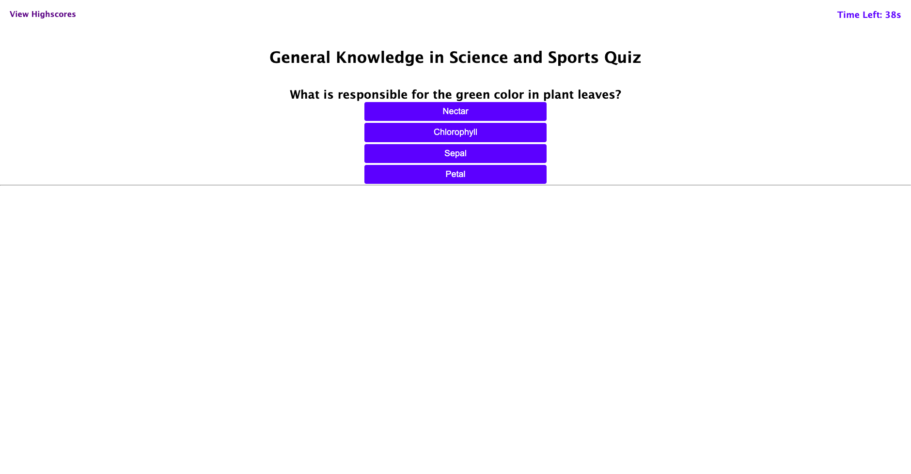

# Creating a General Knowledge Science and Sports Quiz

## Description
One of the common web applications you will see these days are the ones that require you to interactively click on choices and finally submit your input and receive feedback immediately on all choices made. Examples include and not limited to making online pizza order, writing exams online, playing online knowledge based games, amazon order, etc. With this the client can conveniently know all availablle options and select to get value for their purchases or good feedback. As a web developer this is one of the projects that help me learn and understand what goes into building such web applications for easy accessibility.

The github repository can be found at https://github.com/StanOp09/Code_Quiz

The live website is hosted at https://stanop09.github.io/Code_Quiz/

## Acceptance Criteria
The following acceptance criteria was addopted from https://git.bootcampcontent.com/University-of-Toronto/UTOR-VIRT-FSF-PT-05-2023-U-LOLC/-/tree/main/04-Web-APIs/02-Challenge
```
GIVEN I am taking a code quiz
WHEN I click the start button
THEN a timer starts and I am presented with a question
WHEN I answer a question
THEN I am presented with another question
WHEN I answer a question incorrectly
THEN time is subtracted from the clock
WHEN all questions are answered or the timer reaches 0
THEN the game is over
WHEN the game is over
THEN I can save my initials and my score
```
## Appearance and Functionality


## Credits
Sean Roshan

ChatGPT

https://www.w3schools.com/html/html_links.asp (Accessed 24th June 2023)